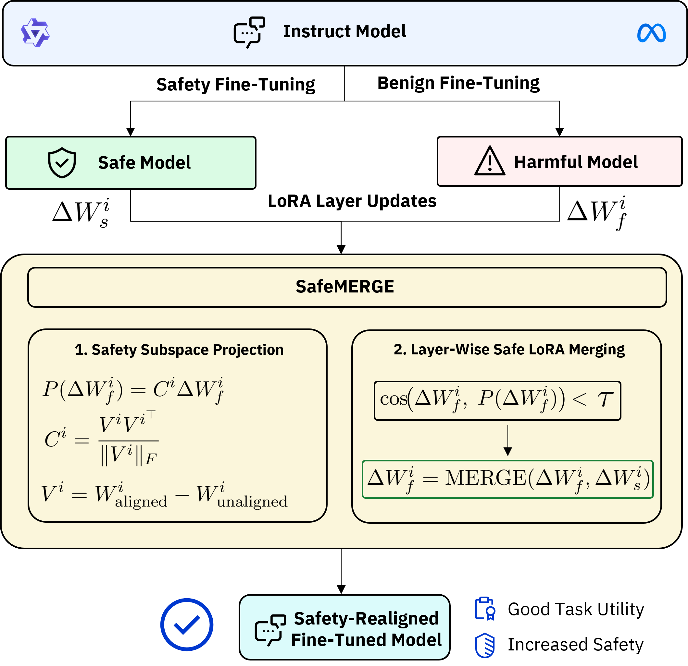

<div align="center">

# SafeMERGE: Preserving Safety Alignment in Fine-Tuned Large Language Models via Selective Layer-Wise Model Merging

[](https://www.nature.com/articles/nature14539)
[](https://papers.nips.cc/paper/2020)

</div>

<!-- <table>
  <tr>
    <td style="vertical-align: top;">
      <strong>Abstract</strong><br>
      Fine-tuning large language models (LLMs) on downstream tasks can inadvertently erode their safety alignment, even for benign fine-tuning datasets. We address this challenge by proposing <strong>SafeMERGE</strong>, a post–fine-tuning framework that preserves safety while maintaining task utility. It achieves this by selectively merging fine-tuned and safety-aligned model layers only when those deviate from safe behavior, measured by a cosine similarity criterion.  
    </td>
    <td style="vertical-align: top;">
      
    </td>
  </tr>
</table> -->

<!-- <table style="width: 100%; table-layout: fixed; border-collapse: collapse;">
  <colgroup>
    <col style="width: 50%;">
    <col style="width: 50%;">
  </colgroup>
  <tr>
    <td style="vertical-align: top; padding: 0 1em 0 0;">
      <strong>Abstract</strong><br>
      Fine-tuning large language models (LLMs) on <br> downstream tasks can inadvertently erode their <br> safety alignment, 
      even for benign fine-tuning <br> datasets. We address this challenge by proposing 
      <strong>SafeMERGE</strong>, a post–fine-tuning framework that <br> preserves safety while maintaining task utility. 
      It achieves this by selectively merging fine-tuned and safety-aligned model layers only when those deviate from 
      safe behavior, measured by a cosine similarity criterion.
    </td>
    <td style="vertical-align: top; padding: 0;">
      
    </td>
  </tr>
</table> -->


<!-- <div style="margin-bottom: 1em;">
  <strong>Abstract</strong><br>
  Fine-tuning large language models (LLMs) on downstream tasks can inadvertently erode their safety alignment, 
  even for benign fine-tuning datasets. We address this challenge by proposing 
  <strong>SafeMERGE</strong>, a post–fine-tuning framework that preserves safety while maintaining task utility. 
  It achieves this by selectively merging fine-tuned and safety-aligned model layers only when those deviate from 
  safe behavior, measured by a cosine similarity criterion.
</div>

<div style="text-align: center;">
  
</div> -->


<div style="margin-bottom: 1em;">
  <strong>Abstract</strong><br>
  Fine-tuning large language models (LLMs) on downstream tasks can inadvertently erode their safety alignment, 
  even for benign fine-tuning datasets. We address this challenge by proposing 
  <strong>SafeMERGE</strong>, a post–fine-tuning framework that preserves safety while maintaining task utility. 
  It achieves this by selectively merging fine-tuned and safety-aligned model layers only when those deviate from 
  safe behavior, measured by a cosine similarity criterion.
</div>

<div style="margin-top: 1em; text-align: center;">
  
</div>


---

## Overview
The key idea is to use a projection matrix to measure how much a finetuned adapter's weights deviate from a safe reference. If the cosine similarity between the projected finetuned weights and the original weights falls below a specified threshold, a partial merge is applied (e.g., using weights `[0.8, 0.2]` for the finetuned and safe adapters, respectively). Otherwise, the finetuned adapter is used without adjustment.

---

## Files
- **`utils.py`**  
  Contains helper functions to compute projection matrices and cosine similarity between LoRA weight differences, and defines the `SafeLoRAMerger` class which encapsulates the merging logic. Merging is done 1:1 as in PEFT! 

- **`get_safemerge_model.py`**  
  A simple command-line script that computes the SafeMERGE model and saves it to an output directory.

---

## Requirements

Tested with Python 3.11.4 and PyTorch 2.4.1 + CUDA 12.1, which can be installed via:
```bash
  pip install torch==2.4.1 torchvision==0.19.1 torchaudio==2.4.1 --index-url https://download.pytorch.org/whl/cu121
```

Install the repository requirements via:
```bash
pip install -r requirements.txt
```

---

## Usage Example

```bash
    python get_safemerge_model.py \
    --base_model_id meta-llama/Llama-2-7b-chat-hf \
    --finetuned_model_id my_hf_repo/llama_2_7b_chat_hf_gsm8k \
    --safety_model_id my_hf_repo/llama_2_7b_chat_hf_safety_tuned \
    --safelora_unaligned_model_id meta-llama/Llama-2-7b-hf \
    --safelora_aligned_model_id meta-llama/Llama-2-7b-chat-hf \
    --cos_threshold 0.35 \
    --default_merge_ratio 0.2 \
    --weighting "[0.8, 0.2]" \
    --merge_type linear \
    --density 0.5 \
    --output_path ./safemerge_models
```

This command will:
1. Load the base model.
2. Load the finetuned and safety adapters. 
3. Compute the safety subspace from the specified unaligned and aligned models.
4. Merge the adapters based on the cosine similarity threshold (using partial merging if the similarity is below 0.35).
5. Save the final SafeMERGE model in the specified output directory.

---

### Implementational Note: Why Qwen Models Are Handled Differently
Qwen models include additional parameters, such as biases, that are not part of the LoRA layers. These extra parameters often have shapes that do not match the expected 2D structure used for LoRA projections (e.g., 1D biases). As a result, when a Qwen model is detected, the code **skips non-2D parameters** to ensure that only valid 2D LoRA parameters are processed during projection.
